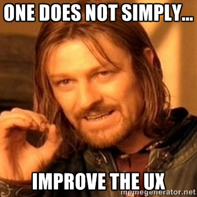

# nTestr

`draft` `work in progress` `idea`

In September 2023 the [Nostr Design](https://nostrdesign.org/) initiative launched to [take Nostr mainstream](https://opensats.org/blog/announcing-nostr-design).

## Purpose
The purpose of nTestr is to complement this initiative with providing a set of testing services. The outcomes of these tests will be a mix of technical and usability improvements.
It could also enhance traditional bug reporting.
nTestr could be a service provided by [Sebastix](https://sebastix.nl/nostr-research-and-development) (or other entities) available for each Nostr developer out there, serving the Nostr development community.

  
* Is a feature working as expected?
* Is someone experiencing strange behaviour, but they don't know how they can provide you with sufficient details on this issue?

Debugging or reproducing problems can be really a hard challenge. And as a developer you would like to know as many details as possible and create an environment where you can reproduce the problem. 

  
"It works on my machine" is a meme we often hear when we report a bug or issue to developers.
With Nostr we don't have a test or acceptance environment with the same amount of interaction with every Nostrich out there. 
This means most tests only work out there within the Nostr ecosystem. With the many variables on the network the scenarios where things don't work as expected are almost endless. 
Especially now when we're still in a very early and experimental phase of adopting Nostr. 

## Roadmap
* [ ] Add documention with best-practices on **usability testing**
* [ ] Add documentation about **performance testing**
* [ ] Add documentation how you can use **functional testing** in your codebase
* [ ] Add documentation about **security testing**
* [ ] Add documentation how you can **automate testing**
* [ ] Add documentation how to **execute A/B testing**

## Submit your test request
For now, please send a mail to _info[at]sebastix.nl_ with your question on how I could help testing your clients or other stuff.  
In the future we will research other ways how to request a test, like mentioning the nTestr Nostr account or using a specific tag inside your event.

## What you will receive

A test report will include at least the following details:
* When the test was done
* What is the expected result
* What was the result
* Steps how to reproduce the issue
* Details about the used device and software

---

### About nTestr
nTestr is set up by Sebastian Hagens. He is an independent, self-taught fullstack webdeveloper working with PHP, JavaScript and many more open web tooling since 2001. He studied interaction design and has a bachelor of design. Besides webdevelopment he has expierence with interaction design and helps people and businesses as a tech consultant achieving ambitious digital goals.
So he is really a generalist with good communication skills and cares about details.

Back in 2009 he started to realise the web is broken because we're giving away our data and the tech monopolies don't care about our digital wellbeing. Nostr can fix this. Read his blog [Why Nostr resonates](https://sebastix.nl/blog/why-nostr-resonates/).

I believe we need nTestr to provide the Nostr developers more constructive feedback on what they are building. With this feedback Nostr developers will optimize their software for better usability and performance.
This increases the Nostr adoption, because the overall Nostr experience will improve. With this growing adoption, we're moving forward to [making Nostr mainstream](https://opensats.org/blog/announcing-nostr-design).

---

### NIP proposal for gamify testing work with Nostr 
#### Does this makes sense? Any feedback welcome!
A specific test could be an event signed by the person who performed the test. With an easy-to-use test client (or integrated widget in a Nostr client), everyone could submit a test report and share this with the developer.
Then the developer could comment on this report with a reaction, change the status, zap the author of the test. Other people could zap the test as well, as a way to value the provided feedback and give it some prioritizing.
If the developer has solved the issue, he could ask the author for a re-test with a time-lock and add an optional zap reward. If the time-lock expires, other people could accomplish this.

---

Author: Sebastian Hagens - https://sebastix.nl/nostr-research-and-development    
Nostr: `npub1qe3e5wrvnsgpggtkytxteaqfprz0rgxr8c3l34kk3a9t7e2l3acslezefe` / `sebastian@sebastix.dev`